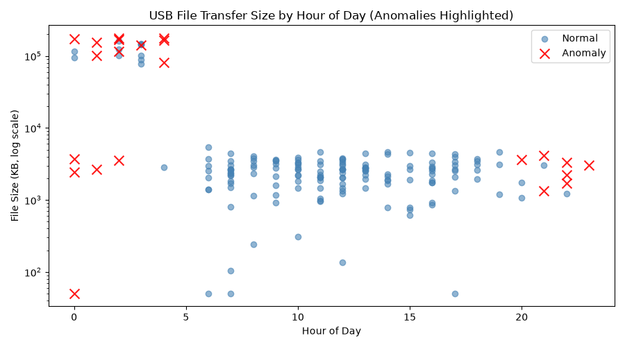

# Final Project Forensic Report: USB Device Data Exfiltration Investigation

## Executive Summary
This investigation looked at 180 simulated USB device activity logs across eight monitored workstations to check for possible insider data exfiltration. An Isolation Forest anomaly detection model was applied using file size, hour of day, device type, action type, and after hours/large transfer flags. Out of the 180 records, 22 events were flagged as anomalous. These flagged events were mostly large file transfers (70,000 KB and above) that happened between midnight and 4 AM, which is well outside normal business hours. A lot of these also involved sensitive files like salary records, client databases, and confidential reports. This pattern is consistent with a possible after hours data exfiltration attempt instead of normal employee activity.

## Methodology
1. **Data Acquisition:** A simulated dataset of 180 USB device activity logs was generated. This included the fields timestamp, user_id, host_computer, device_id, device_type (USB Flash Drive, External HDD, SD Card, Smartphone), action (COPY, DELETE, CONNECT, DISCONNECT, RENAME), file_name, and file_size_kb for each event.
2. **Preprocessing:** Missing file sizes were filled in using the median value, timestamps were converted into proper datetime objects, and new features were added: hour_of_day, is_weekend, is_after_hours, file_extension, and is_large_transfer.
3. **Analysis:** An Isolation Forest model, which is an unsupervised anomaly detection algorithm, was trained on file size, hour of day, device type, action type, weekend flag, after hours flag, and large transfer flag to find events that were very different from normal USB usage patterns.
4. **Visualization:** A scatter plot was made showing file size (log scale) against hour of day, with the anomalous events highlighted in red so it is easier to see the suspicious large, after hours transfers compared to normal daytime USB activity.

## Key Findings
- **Total events analyzed:** 180 simulated USB transfer logs
- **Anomalous events detected:** 22
- **Deliberately planted anomalies in the simulated data:** 22 (large, after hours transfers)
- The model's detection count matched the planted anomaly count exactly, and there were no false positives found among the normal records that were checked. The flagged anomalies were mostly grouped in the early morning hours (around midnight to 4 AM) and involved file sizes well above 70,000 KB, which is way higher than the usual transfer size of a few thousand KB seen in normal daytime activity. The flagged transfers often involved sensitive file types such as salary_data.xlsx, client_database.csv, confidential_report.pdf, and merger_agreement.docx, and these were mostly copied to USB Flash Drives or External HDDs.

*Figure: File size (KB, log scale) by hour of day for USB device activity. Anomalous events, flagged by the Isolation Forest model, are shown in red.*

## Conclusion
The flagged events show a clear and consistent difference from normal USB usage across the monitored workstations, and the model's 22 detected anomalies matched exactly with the anomalies that were planted in the simulated dataset. This shows that combining file size, time of day, and transfer behavior features with an Isolation Forest model can be an effective way to find suspicious USB activity even without labeled examples of "malicious" behavior beforehand. In a real investigation, these findings would need further manual review, especially for the specific user IDs and host computers connected to these large, after hours transfers of sensitive files. Some recommended next steps are restricting USB write access for sensitive file types outside of business hours, setting up real time alerts for large transfers that match this pattern, and checking the flagged user IDs against physical access logs to confirm if the employee was actually on site during the transfer.

## References
- Pandas (data manipulation)
- Scikit-learn, IsolationForest (unsupervised anomaly detection)
- Matplotlib (data visualization)