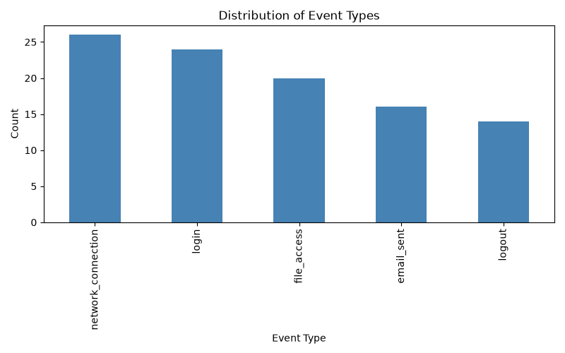

# Forensic Investigation Report

**Generated:** 2026-08-20 13:52:24

## Executive Summary

This report summarizes the findings of an automated forensic analysis conducted on a simulated digital evidence dataset. A total of 100 events were analyzed, of which 85 were flagged as anomalous by an unsupervised machine learning model. Additionally, 130 named entities were extracted from message content, providing potential investigative leads.

## Methodology

The investigation followed a structured pipeline: raw event data was acquired and cleaned, new time-based features (hour of day, day of week, weekend flag) were engineered, an Isolation Forest model was applied to detect anomalous behavior, and a Named Entity Recognition (NER) model (SpaCy) was used to extract people, organizations, and locations from message text.

## Key Findings

- **Total events analyzed:** 100
- **Anomalous events detected:** 85
- **Named entities extracted:** 130

### Entity Breakdown

- **PERSON:** 48
- **CARDINAL:** 34
- **ORG:** 32
- **GPE:** 16

## Event Distribution Visualization

